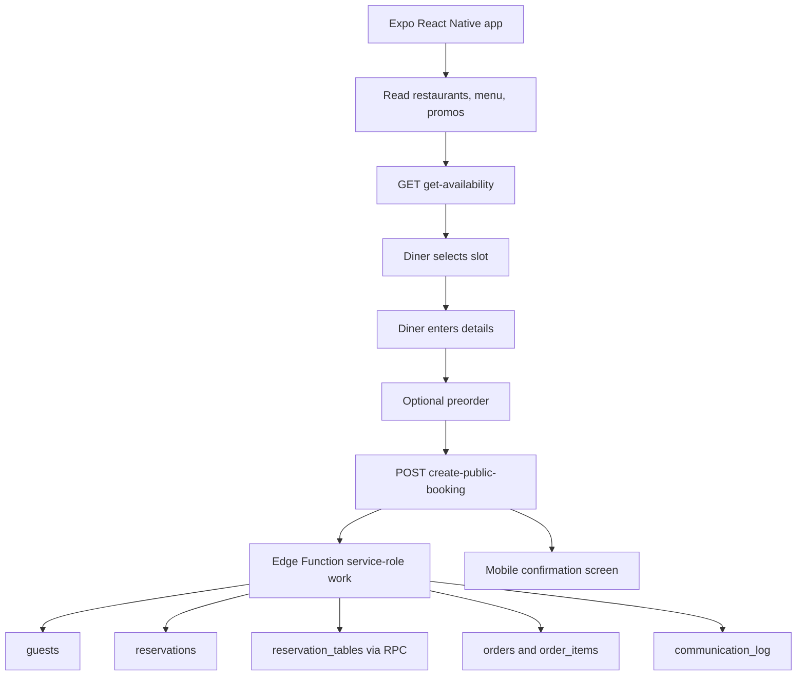

# Mobile Diner Booking Flow Implementation Guide

This document explains, in detail, how Cenaiva's current diner booking flow works on the web and how to implement the same flow in an Expo/React Native mobile app that shares the same Supabase database.

It is written for a coding agent or engineer implementing the mobile app. Do not treat this as product marketing copy. Treat it as an implementation contract.

## Executive Summary

The mobile app should not insert reservations directly into Supabase tables.

The mobile app should:

1. Read public restaurant/menu/promotion data from Supabase using the anon client.
2. Ask the `get-availability` Edge Function for bookable time slots.
3. Let the diner choose a slot and enter guest details.
4. Optionally let the diner add preorder items.
5. Submit the final booking to the `create-public-booking` Edge Function.
6. Show the confirmation code returned by the Edge Function.
7. If the diner is logged in, pass the Supabase access token so the booking is linked to their customer profile.
8. Fetch customer bookings by reading the diner-linked `guests` rows and then their `reservations`.

The critical backend work is already handled by Supabase Edge Functions and RPCs:

- Capacity validation
- Shift validation
- Duplicate detection
- Guest creation/linking
- Reservation creation
- Table assignment
- Preorder creation
- Promotion usage increments
- Email/SMS confirmation delivery
- Dashboard/floor-plan visibility for restaurant staff

The mobile app only needs to call the same public APIs correctly.

## Source Of Truth In The Web App

Current implementation files:

- `apps/web/src/pages/customer/RestaurantPublicPage.tsx`
  - Main diner booking page.
  - Route: `/:restaurantSlug`.
  - Owns the booking wizard: details, menu, checkout, confirmed.
  - Builds the `create-public-booking` payload.

- `apps/web/src/hooks/useAvailability.ts`
  - Client wrapper for `get-availability`.
  - Adds short-lived caching and request deduplication.

- `supabase/functions/get-availability/index.ts`
  - Edge Function that returns real bookable slots.
  - Uses restaurant hours, shifts, floor capacity, existing reservations, and table assignment preflight.

- `supabase/functions/create-public-booking/index.ts`
  - Edge Function that creates the booking.
  - This is the most important file for mobile parity.

- `apps/web/src/hooks/useMyReservations.ts`
  - How a logged-in diner sees their bookings after creation.

- `supabase/functions/get-order-public/index.ts`
  - Special deep-link flow for existing voice-created/prepay orders.
  - Mobile can ignore this initially unless implementing the same "resume checkout from order_id" path.

- `apps/web/src/lib/computePromoDiscount.ts`
  - Client-side promotion discount calculation.

- `apps/web/src/lib/reservations/displayStatus.ts`
  - Shared logic for showing upcoming/current/past/cancelled booking buckets.

## Non-Negotiable Rules For Mobile

These are the rules that protect table assignment and dashboard visibility.

1. Do not insert into `reservations` directly from mobile.
2. Do not insert into `reservation_tables` directly from mobile.
3. Do not call `assign_reservation_tables` directly from mobile.
4. Do not ship the Supabase service role key in the mobile app.
5. Do call `create-public-booking` to create reservations.
6. Do call `get-availability` before letting the diner pick a time.
7. Always send the exact selected slot ISO timestamp as `date_time`.
8. Treat `reserved_at` as one ISO timestamp. Do not split date and time in the database.
9. Pass `Authorization: Bearer <access_token>` when the diner is logged in.
10. Handle stale availability. A slot can disappear between viewing it and submitting it.
11. Treat a `409` response as a normal product case, not a crash.
12. Treat `reused: true` as success. It means the backend found an existing matching booking.

## High-Level Architecture



## Current Web Diner Journey

The current web journey happens on the public restaurant page.

Route:

```text
/:restaurantSlug
```

Example:

```text
/my-restaurant-slug
```

The page can also receive booking query params:

```text
/:restaurantSlug?slot=<iso>&time=<display>&people=<number>&date=<YYYY-MM-DD>&shift_id=<uuid>
```

The normal diner flow is:

1. Diner opens a restaurant page.
2. App loads restaurant data.
3. App loads menu categories and menu items.
4. App loads active promotions.
5. Diner chooses party size and date.
6. App fetches availability for that restaurant/date/party size.
7. Diner picks a time slot.
8. Diner enters name, email, phone, seating preference, occasion, and allergies.
9. Diner continues to optional preorder.
10. If cart is empty, diner can skip preorder and confirm immediately.
11. If cart has items, diner reviews checkout.
12. App submits `create-public-booking`.
13. Backend creates guest, reservation, table assignment, optional order, and confirmation log.
14. App shows confirmation code.

## Booking Wizard Steps

The web app uses this state type:

```ts
type Step = "details" | "menu" | "checkout" | "confirmed";
```

For mobile, use the same state machine.

### Step 1: Details

Collect:

- Date
- Time slot
- Party size
- Guest full name
- Guest email
- Guest phone
- Seating preference
- Occasion
- Allergies or dietary notes

The web app only allows moving forward when:

- `date` exists
- `name` exists
- `email` exists
- `party_size` is a number
- `party_size >= 1`
- `party_size <= maxBookablePartySize`
- `selectedBookingSlot` exists

The web app uses an HTML email input, but there is no deep custom regex validation. In React Native, you should add basic email validation for a better mobile experience, but do not block backend compatibility by changing payload names.

Phone is optional for proceeding, but send it if present. It helps duplicate detection and SMS confirmation fallback.

### Step 2: Menu

Preorder is optional.

The diner can:

- Add no items and confirm the reservation.
- Add menu items and continue to checkout.

Important current behavior:

- Web shows active and available menu items with a category.
- Web does not currently filter public preorder items by `is_preorderable`.
- Item notes/modifications exist in local cart state but are not sent to `create-public-booking`.
- The Edge Function only receives `menu_item_id`, `name`, `quantity`, and `unit_price`.

If the mobile app needs item notes, that is a backend/product change. Do not assume notes are saved by the current public booking flow.

### Step 3: Checkout

The current web checkout is not a real card charge.

It collects demo-style card fields and stores:

```text
payment_method: "card" | "split"
```

There is no Stripe payment intent in `RestaurantPublicPage.tsx` for this flow.

Important:

- Single card mode is not gated on card completeness.
- Split mode is gated on locally filled card rows.
- The Edge Function records payment metadata on the order if there is a preorder.
- The Edge Function does not charge the card.

For mobile, decide whether to:

- Match current behavior exactly: create booking and persist `payment_method`.
- Or implement real payments later through the existing Stripe Edge Functions.

This document covers matching the current booking flow, not adding real payment processing.

### Step 4: Confirmed

Show:

- Confirmation code
- Confirmation delivery status
- Restaurant name
- Date/time
- Party size
- Optional preorder summary

The Edge Function returns the source of truth confirmation code. Do not generate a separate mobile-only code.

## Core Mobile State Shape

Recommended mobile state:

```ts
type BookingStep = "details" | "menu" | "checkout" | "confirmed";

type DineInDetails = {
  date: string; // YYYY-MM-DD
  time: string; // Display label, for UI only
  party_size: number | "";
  seating_preference: string;
  name: string;
  email: string;
  phone: string;
  allergies: string;
  occasion: string;
};

type MobileMenuItem = {
  id: string;
  name: string;
  description: string;
  price: number;
  category: string;
  popular: boolean;
  dietary: string[];
  photoUrl: string | null;
  allergens: string[];
  ingredients: string;
};

type CartItem = MobileMenuItem & {
  qty: number;
  note?: string;
};

type AvailabilitySlot = {
  shift_id: string;
  shift_name: string;
  date_time: string; // ISO timestamp, this is what must be submitted
  display_time: string;
  table_ids?: string[];
  duration_minutes?: number;
  floor_capacity?: number;
};

type ConfirmationDeliveryStatus = "sent" | "skipped" | "failed";
type ConfirmationDeliveryChannel = "email" | "sms" | null;

type BookingConfirmation = {
  reservation_id: string;
  order_id: string | null;
  confirmation_code: string;
  table_ids: string[];
  duration_minutes: number | null;
  confirmation_delivery: ConfirmationDeliveryStatus;
  confirmation_delivery_channel: ConfirmationDeliveryChannel;
  reused?: boolean;
};
```

## Supabase Client Setup In Expo

Use the same Supabase project URL and anon key as the web app.

Web env names:

```text
VITE_SUPABASE_URL
VITE_SUPABASE_ANON_KEY
```

Expo public env names should be something like:

```text
EXPO_PUBLIC_SUPABASE_URL=https://exbjodmnpdiayfzrdyux.supabase.co
EXPO_PUBLIC_SUPABASE_ANON_KEY=<anon-or-publishable-key>
```

Never add this to the mobile app:

```text
SUPABASE_SERVICE_ROLE_KEY
```

Recommended mobile client:

```ts
import AsyncStorage from "@react-native-async-storage/async-storage";
import { createClient } from "@supabase/supabase-js";

const supabaseUrl = process.env.EXPO_PUBLIC_SUPABASE_URL!;
const supabaseAnonKey = process.env.EXPO_PUBLIC_SUPABASE_ANON_KEY!;

export const supabase = createClient(supabaseUrl, supabaseAnonKey, {
  auth: {
    storage: AsyncStorage,
    autoRefreshToken: true,
    persistSession: true,
    detectSessionInUrl: false,
  },
});
```

Install packages if the mobile app does not already have them:

```bash
npm install @supabase/supabase-js @react-native-async-storage/async-storage react-native-url-polyfill
```

In the Expo app entry file, import:

```ts
import "react-native-url-polyfill/auto";
```

## Public Restaurant Data

The web app loads one restaurant by slug or UUID.

Behavior:

- If the identifier is a UUID, query `restaurants.id`.
- Otherwise query `restaurants.slug`.

Mobile function:

```ts
const UUID_RE = /^[0-9a-f]{8}-[0-9a-f]{4}-[0-9a-f]{4}-[0-9a-f]{4}-[0-9a-f]{12}$/i;

export async function fetchRestaurant(slugOrId: string) {
  const column = UUID_RE.test(slugOrId) ? "id" : "slug";

  const { data, error } = await supabase
    .from("restaurants")
    .select("*")
    .eq(column, slugOrId)
    .single();

  if (error) throw error;
  return data;
}
```

For restaurant discovery, the web app uses active restaurants ordered by rating:

```ts
const { data, error } = await supabase
  .from("restaurants")
  .select("*")
  .eq("is_active", true)
  .order("avg_rating", { ascending: false, nullsFirst: false });
```

## Public Menu Data

### Categories

Web query:

```ts
const { data, error } = await supabase
  .from("menu_categories")
  .select("*")
  .eq("restaurant_id", restaurantId)
  .eq("is_active", true)
  .order("sort_order");
```

### Items

Web query:

```ts
const { data, error } = await supabase
  .from("menu_items")
  .select("*")
  .eq("restaurant_id", restaurantId)
  .eq("is_active", true)
  .eq("is_available", true)
  .not("category_id", "is", null)
  .order("sort_order");
```

Map DB rows into mobile menu rows:

```ts
function mapMenuItems(items: MenuItemRow[], categories: MenuCategoryRow[]): MobileMenuItem[] {
  const activeCategoriesById = new Map(categories.map((category) => [category.id, category]));

  return items.flatMap((row) => {
    const category = row.category_id ? activeCategoriesById.get(row.category_id) : null;
    if (!category) return [];

    return [{
      id: row.id,
      name: row.name,
      description: row.description ?? "",
      price: Number(row.price ?? 0),
      category: category.name,
      popular: Boolean(row.is_featured),
      dietary: row.dietary_flags ?? [],
      photoUrl: row.photo_url,
      allergens: row.allergens ?? [],
      ingredients: row.description ?? "",
    }];
  });
}
```

## Promotions

The booking page can apply active restaurant promotions to the preorder cart.

The web app loads active promotions across all restaurants and filters for the current restaurant.

For mobile, you can either:

- Copy the same global active promotions query.
- Or query active promotions for the selected restaurant only.

The discount logic currently supports:

- `bogo`
- `percentage`
- `fixed`
- `free_item`

Current discount behavior:

```ts
type CartLine = { id: string; price: number; qty: number };

function computePromoDiscount(cart: CartLine[], promo: PromotionRow) {
  const cartTotal = cart.reduce((sum, item) => sum + item.price * item.qty, 0);
  if (cartTotal <= 0) return { discount: 0, appliedTo: [] };

  switch (promo.promo_type) {
    case "bogo": {
      const eligible = promo.bogo_item_ids.length > 0
        ? cart.filter((item) => promo.bogo_item_ids.includes(item.id))
        : cart;
      const buy = promo.buy_quantity ?? 1;
      const get = promo.get_quantity ?? 1;
      const cycle = buy + get;
      let discount = 0;
      const appliedTo: string[] = [];

      for (const line of eligible) {
        const freeUnits = Math.floor(line.qty / cycle) * get;
        if (freeUnits > 0) {
          discount += freeUnits * line.price;
          appliedTo.push(line.id);
        }
      }

      return { discount: Math.min(discount, cartTotal), appliedTo };
    }

    case "percentage": {
      if (!promo.discount_value) return { discount: 0, appliedTo: [] };
      if (promo.min_order_amount != null && cartTotal < promo.min_order_amount) {
        return { discount: 0, appliedTo: [] };
      }
      const eligible = promo.eligible_item_ids.length > 0
        ? cart.filter((item) => promo.eligible_item_ids.includes(item.id))
        : cart;
      const eligibleSubtotal = eligible.reduce((sum, item) => sum + item.price * item.qty, 0);
      return {
        discount: Math.min(eligibleSubtotal * (promo.discount_value / 100), cartTotal),
        appliedTo: eligible.map((item) => item.id),
      };
    }

    case "fixed": {
      if (!promo.discount_value) return { discount: 0, appliedTo: [] };
      if (promo.min_order_amount != null && cartTotal < promo.min_order_amount) {
        return { discount: 0, appliedTo: [] };
      }
      const eligible = promo.eligible_item_ids.length > 0
        ? cart.filter((item) => promo.eligible_item_ids.includes(item.id))
        : cart;
      const eligibleSubtotal = eligible.reduce((sum, item) => sum + item.price * item.qty, 0);
      return {
        discount: Math.min(promo.discount_value, eligibleSubtotal, cartTotal),
        appliedTo: eligible.map((item) => item.id),
      };
    }

    case "free_item": {
      if (!promo.free_item_id) return { discount: 0, appliedTo: [] };
      const line = cart.find((item) => item.id === promo.free_item_id);
      if (!line) return { discount: 0, appliedTo: [] };
      return { discount: Math.min(line.price, cartTotal), appliedTo: [line.id] };
    }

    default:
      return { discount: 0, appliedTo: [] };
  }
}
```

## Availability API

Mobile must call availability before booking.

Endpoint:

```text
GET {SUPABASE_URL}/functions/v1/get-availability?restaurant_id={restaurantId}&date={YYYY-MM-DD}&party_size={partySize}
```

Headers:

```text
apikey: <anon key>
Authorization: Bearer <access token>    optional
```

Response:

```ts
type GetAvailabilityResponse = {
  slots?: AvailabilitySlot[];
  floor_capacity?: number;
  error?: string;
};
```

Slot:

```ts
type AvailabilitySlot = {
  shift_id: string;
  shift_name: string;
  date_time: string;
  display_time: string;
  table_ids?: string[];
  duration_minutes?: number;
  floor_capacity?: number;
};
```

Mobile implementation:

```ts
export async function getAvailability(params: {
  restaurantId: string;
  date: string; // YYYY-MM-DD
  partySize: number;
}) {
  const { data: sessionData } = await supabase.auth.getSession();
  const token = sessionData.session?.access_token ?? null;

  const url = new URL(`${supabaseUrl}/functions/v1/get-availability`);
  url.searchParams.set("restaurant_id", params.restaurantId);
  url.searchParams.set("date", params.date);
  url.searchParams.set("party_size", String(Math.max(1, Math.floor(params.partySize))));

  const response = await fetch(url.toString(), {
    headers: {
      apikey: supabaseAnonKey,
      ...(token ? { Authorization: `Bearer ${token}` } : {}),
    },
  });

  const body = await response.json() as GetAvailabilityResponse;

  if (!response.ok || body.error) {
    throw new Error(body.error ?? "Could not load availability.");
  }

  return {
    slots: (body.slots ?? []).filter((slot) => new Date(slot.date_time).getTime() >= Date.now()),
    floorCapacity: body.floor_capacity ?? body.slots?.find((slot) => typeof slot.floor_capacity === "number")?.floor_capacity ?? null,
  };
}
```

### Availability Caching

The web app caches availability for 45 seconds per:

```text
restaurantId | date | partySize
```

Mobile can do the same in memory:

```ts
const AVAILABILITY_CACHE_TTL_MS = 45_000;
```

Do not cache longer than this without revalidating. Availability is volatile because another diner or staff member can book the same table.

### What `get-availability` Does Internally

The Edge Function:

1. Reads `restaurant_id`, `date`, and `party_size`.
2. Loads restaurant `settings_json`, `hours_json`, and `timezone`.
3. Defaults timezone to `America/Toronto` if missing.
4. Calculates the local day of week.
5. Calls `restaurant_floor_capacity`.
6. Returns no slots if `party_size` is less than 1 or greater than floor capacity.
7. Reads active shifts for that restaurant and local day:
   - `is_active = true`
   - `days_of_week` contains the local day index
8. Reads active reservations for that day:
   - `pending`
   - `confirmed`
   - `seated`
9. Generates slots using shift start/end and slot duration.
10. Skips slots in the past.
11. Checks shift cover capacity using overlapping reservations.
12. Calls `find_available_table_group` for each candidate slot.
13. Only returns slots where the RPC can find at least one table/group that fits.

This means the returned slots are already table-aware.

## Time And Date Rules

Mobile should keep two separate UI fields:

```ts
date: "2026-05-06"       // UI date picker value
time: "7:00 PM"          // UI label only
```

But the backend booking payload must use:

```ts
date_time: selectedSlot.date_time
```

Do not build the booking timestamp by concatenating `date + "T" + time`.

The selected slot already contains the correct ISO timestamp:

```json
{
  "date_time": "2026-05-06T23:00:00.000Z",
  "display_time": "7:00 PM"
}
```

Submit `date_time`, not the display label.

## Selecting A Slot

Recommended mobile state:

```ts
const [slots, setSlots] = useState<AvailabilitySlot[]>([]);
const [selectedSlot, setSelectedSlot] = useState<AvailabilitySlot | null>(null);
```

When the diner changes date or party size:

1. Clear selected slot.
2. Fetch availability.
3. Render returned slots.
4. Let the diner tap one slot.

Do not rely on display labels as unique IDs. Use `slot.date_time` plus `slot.shift_id`.

Recommended key:

```ts
function availabilitySlotKey(slot: AvailabilitySlot) {
  return `${slot.shift_id}|${slot.date_time}`;
}
```

## Booking Details Form

Recommended form values:

```ts
const initialDetails: DineInDetails = {
  date: "",
  time: "",
  party_size: 2,
  seating_preference: "",
  name: "",
  email: "",
  phone: "",
  allergies: "",
  occasion: "",
};
```

If the diner is logged in, prefill from their profile:

- `full_name` -> `name`
- `email` -> `email`
- `phone` -> `phone`
- `allergies` -> comma-separated `allergies`
- `seating_preference` -> `seating_preference`

The web app only fills empty fields. It does not overwrite what the diner has typed.

Mobile should follow the same behavior:

```ts
function prefillDetailsFromProfile(details: DineInDetails, profile: UserProfile): DineInDetails {
  return {
    ...details,
    name: details.name || profile.full_name || "",
    email: details.email || profile.email || "",
    phone: details.phone || profile.phone || "",
    allergies: details.allergies || (profile.allergies ?? []).join(", "),
    seating_preference: details.seating_preference || profile.seating_preference || "",
  };
}
```

## Booking Submit API

Endpoint:

```text
POST {SUPABASE_URL}/functions/v1/create-public-booking
```

Headers:

```text
apikey: <anon key>
Content-Type: application/json
Authorization: Bearer <access token>    optional but important for logged-in diners
```

The Edge Function has `verify_jwt = false` in `supabase/config.toml`, but it still manually validates the optional Bearer token to link the booking to the logged-in diner profile.

### Required Payload Fields

The backend requires:

```ts
restaurant_id: string; // UUID
shift_id: string;      // UUID
date_time: string;     // valid ISO timestamp
guest_name: string;
guest_email: string;
```

If any of those are missing, the function returns `400`.

### Full Payload Shape

```ts
type PublicBookingPayload = {
  restaurant_id: string;
  shift_id: string;
  date_time: string;
  party_size: number;
  guest_name: string;
  guest_email: string;
  guest_phone: string | null;
  allergies: string | null;
  seating_preference: string | null;
  occasion: string | null;
  cart_items: PublicBookingCartItem[];
  subtotal: number;
  tax_amount: number;
  tip_amount: number;
  total_amount: number;
  discount_amount: number | null;
  discount_reason: string | null;
  promotion_id: string | null;
  payment_method: "card" | "split";
};

type PublicBookingCartItem = {
  menu_item_id: string | null;
  name: string;
  quantity: number;
  unit_price: number;
};
```

### Payload Example: Reservation Without Preorder

```json
{
  "restaurant_id": "00000000-0000-0000-0000-000000000000",
  "shift_id": "11111111-1111-1111-1111-111111111111",
  "date_time": "2026-05-06T23:00:00.000Z",
  "party_size": 2,
  "guest_name": "Jane Diner",
  "guest_email": "jane@example.com",
  "guest_phone": "+14165550123",
  "allergies": null,
  "seating_preference": "By the window",
  "occasion": "Birthday",
  "cart_items": [],
  "subtotal": 0,
  "tax_amount": 0,
  "tip_amount": 0,
  "total_amount": 0,
  "discount_amount": null,
  "discount_reason": null,
  "promotion_id": null,
  "payment_method": "card"
}
```

### Payload Example: Reservation With Preorder

```json
{
  "restaurant_id": "00000000-0000-0000-0000-000000000000",
  "shift_id": "11111111-1111-1111-1111-111111111111",
  "date_time": "2026-05-06T23:00:00.000Z",
  "party_size": 2,
  "guest_name": "Jane Diner",
  "guest_email": "jane@example.com",
  "guest_phone": "+14165550123",
  "allergies": "peanuts",
  "seating_preference": "By the window",
  "occasion": "Birthday",
  "cart_items": [
    {
      "menu_item_id": "22222222-2222-2222-2222-222222222222",
      "name": "Truffle Pasta",
      "quantity": 2,
      "unit_price": 28.5
    }
  ],
  "subtotal": 57,
  "tax_amount": 7.41,
  "tip_amount": 10.26,
  "total_amount": 74.67,
  "discount_amount": null,
  "discount_reason": null,
  "promotion_id": null,
  "payment_method": "card"
}
```

### Mobile Submit Function

```ts
function roundMoney(value: number): number {
  return Math.round(value * 100) / 100;
}

export async function createPublicBooking(payload: PublicBookingPayload) {
  const { data: sessionData } = await supabase.auth.getSession();
  const token = sessionData.session?.access_token ?? null;

  const response = await fetch(`${supabaseUrl}/functions/v1/create-public-booking`, {
    method: "POST",
    headers: {
      apikey: supabaseAnonKey,
      "Content-Type": "application/json",
      ...(token ? { Authorization: `Bearer ${token}` } : {}),
    },
    body: JSON.stringify(payload),
  });

  const body = await response.json().catch(() => ({})) as PublicBookingResponse;

  if (!response.ok || body.error || !body.reservation_id) {
    const error = new Error(body.error ?? "Reservation failed");
    (error as Error & { status?: number }).status = response.status;
    throw error;
  }

  return body;
}
```

Recommended response type:

```ts
type PublicBookingResponse = {
  reservation_id?: string;
  order_id?: string | null;
  confirmation_code?: string;
  table_ids?: string[];
  duration_minutes?: number;
  confirmation_delivery?: "sent" | "skipped" | "failed";
  confirmation_delivery_channel?: "email" | "sms" | null;
  reused?: boolean;
  floor_capacity?: number;
  error?: string;
};
```

## Duplicate Submit Protection

Use both UI and ref protection.

Mobile equivalent:

```ts
const placingRef = useRef(false);
const [placing, setPlacing] = useState(false);

async function onSubmitBooking() {
  if (placingRef.current) return;

  placingRef.current = true;
  setPlacing(true);

  try {
    const response = await createPublicBooking(payload);
    setConfirmation(response);
    setStep("confirmed");
  } catch (error) {
    setOrderError(error instanceof Error ? error.message : "Failed to place booking.");
  } finally {
    placingRef.current = false;
    setPlacing(false);
  }
}
```

Disable the submit button while `placing` is true.

## What The Booking Edge Function Does

`create-public-booking` performs the full write transaction-style workflow.

It does not use a formal SQL transaction around every step, but it carefully validates and rolls back important failure cases.

### 1. Validate Request

It requires:

- `restaurant_id`
- `shift_id`
- `date_time`
- `guest_name`
- `guest_email`

It normalizes:

- Email: trim and lowercase
- Party size: number, floor, minimum 1
- Cart item quantities: minimum 1
- Money: rounded to 2 decimals

### 2. Optionally Link Logged-In Diner

If the request has:

```text
Authorization: Bearer <token>
```

The Edge Function:

1. Calls `supabase.auth.getUser(token)`.
2. Reads `user_profiles.id` where `auth_user_id` matches the auth user.
3. Stores that profile id as `userProfileId`.

That profile id becomes:

```ts
guests.user_profile_id
```

This is what makes the booking appear in the logged-in diner's booking list.

No token means guest checkout:

```ts
reservations.is_guest_checkout = true
guests.user_profile_id = null
```

Guest-checkout bookings still appear for restaurants/staff, but they do not automatically appear in a future logged-in customer account unless linked by backend logic.

### 3. Validate Turn Time And Shift

The function calls:

```text
restaurant_turn_time_minutes(p_restaurant_id, p_shift_id)
```

Then it checks `shifts`:

- Shift exists
- Shift belongs to the restaurant
- Shift is active

If not, it returns:

```json
{ "error": "Shift not found for this restaurant." }
```

with HTTP `400`.

### 4. Validate Floor Capacity

The function calls:

```text
restaurant_floor_capacity(p_restaurant_id)
```

If the party size is bigger than the restaurant floor capacity, the function returns `409`.

Example:

```json
{
  "error": "This restaurant can take parties up to 12.",
  "floor_capacity": 12
}
```

If there is no saved floor plan:

```json
{
  "error": "This restaurant does not have a saved floor plan yet.",
  "floor_capacity": 0
}
```

### 5. Detect Duplicate Booking By Contact

Before creating a new guest or reservation, the function checks existing reservations with:

- Same `restaurant_id`
- Same exact `reserved_at`
- Same `party_size`
- Same guest email, or same phone if no email match
- Status in `pending`, `confirmed`, or `seated`

If found, it returns success with:

```json
{
  "reservation_id": "<existing>",
  "order_id": "<existing-or-null>",
  "confirmation_code": "<existing-code>",
  "table_ids": [],
  "duration_minutes": 90,
  "reused": true
}
```

Important:

- `table_ids` is empty in this duplicate response.
- This does not mean the reservation has no table.
- It means the function reused the existing reservation and did not re-run assignment.
- If the UI needs table details, refetch the reservation by id.

### 6. Check Cover Capacity

The function looks at overlapping active reservations for the same restaurant and shift.

Statuses counted:

- `pending`
- `confirmed`
- `seated`

If total overlapping party size would exceed `shift.max_covers`, it returns:

```json
{ "error": "This time no longer has enough cover capacity." }
```

with HTTP `409`.

### 7. Preflight Table Assignment

The function calls:

```text
find_available_table_group(
  p_restaurant_id,
  p_reserved_at,
  p_party_size,
  p_turn_minutes
)
```

If no table group is available, it returns:

```json
{ "error": "No available table can fit this party at that time." }
```

with HTTP `409`.

### 8. Resolve Or Create Guest

The function calls:

```text
canonical_guest_id(
  p_restaurant_id,
  p_user_profile_id,
  p_email,
  p_phone
)
```

Then it either inserts or updates a row in `guests`.

Fields:

```ts
{
  restaurant_id: restaurantId,
  user_profile_id: userProfileId,
  full_name: guestName,
  email: guestEmail,
  phone: guestPhone,
  dietary_restrictions: allergiesAsArray,
  seating_preference: seatingPreference
}
```

### 9. Detect Duplicate Booking By Guest Id

After guest resolution, it again checks:

- Same restaurant
- Same guest
- Same exact reserved_at
- Same party size
- Status in `pending`, `confirmed`, or `seated`

If found, returns `reused: true`.

### 10. Insert Reservation

New reservation insert:

```ts
{
  restaurant_id: restaurantId,
  guest_id: guestId,
  shift_id: shiftId,
  party_size: partySize,
  reserved_at: reservedAt.toISOString(),
  duration_minutes: turnMinutes,
  status: "pending",
  source: "web",
  confirmation_code: confirmationCode,
  special_request: allergies,
  dietary_notes: allergies,
  occasion,
  is_guest_checkout: !userProfileId,
  guest_full_name: guestName,
  guest_email: guestEmail,
  guest_phone: guestPhone
}
```

Note: It currently writes `source: "web"` even if called from mobile. If mobile-specific analytics are needed, change the Edge Function later to accept `source: "mobile"`. Do not write reservations directly just to change the source.

### 11. Persist Table Assignment

The function calls:

```text
assign_reservation_tables(
  p_reservation_id,
  p_restaurant_id,
  p_reserved_at,
  p_party_size,
  p_turn_minutes
)
```

That RPC:

- Inserts rows into `reservation_tables`.
- Sets `reservations.table_id` to the first assigned table.
- Sets/syncs `duration_minutes`.

This is why reservations show up on:

- Restaurant dashboard reservations
- Floor plan timeline
- Table cards
- Staff views

If assignment fails after reservation insert, the function cancels the reservation:

```ts
{
  status: "cancelled",
  cancelled_at: new Date().toISOString(),
  cancellation_reason: "No available table for party size."
}
```

and returns `409`.

### 12. Insert Optional Preorder

If `cart_items` is not empty, the function inserts an `orders` row:

```ts
{
  restaurant_id: restaurantId,
  reservation_id: reservationId,
  guest_id: guestId,
  is_preorder: true,
  order_type: "dine_in",
  status: "pending",
  subtotal,
  tax_amount,
  tip_amount,
  total_amount,
  discount_amount,
  discount_reason,
  promotion_id,
  payment_method,
  confirmation_code,
  source: "web"
}
```

Then inserts `order_items`:

```ts
cartItems.map((item) => ({
  ...item,
  order_id: orderId,
  status: "pending"
}))
```

If order item insert fails, the order is marked cancelled.

### 13. Increment Promotion Usage

If `promotion_id` is sent and matches the restaurant, the function increments:

```text
promotions.current_uses
```

### 14. Send Confirmation

The function tries email first if `RESEND_API_KEY` exists and guest email exists.

If email does not send successfully, it can fall back to SMS if:

- Phone exists
- Phone can normalize to North American format
- Twilio env vars exist

It logs attempted delivery in `communication_log`.

The mobile app should display the returned delivery status, but booking success does not depend on message delivery.

## Success And Error Responses

### New Booking Success

```json
{
  "reservation_id": "reservation-uuid",
  "order_id": "order-uuid-or-null",
  "confirmation_code": "SEAT-ABCD",
  "table_ids": ["table-uuid"],
  "duration_minutes": 90,
  "confirmation_delivery": "sent",
  "confirmation_delivery_channel": "email"
}
```

### Duplicate/Reused Success

```json
{
  "reservation_id": "existing-reservation-uuid",
  "order_id": "existing-order-uuid-or-null",
  "confirmation_code": "SEAT-ABCD",
  "table_ids": [],
  "duration_minutes": 90,
  "reused": true
}
```

### Validation Error

HTTP `400`:

```json
{
  "error": "restaurant_id, shift_id, date_time, guest_name, and guest_email are required."
}
```

### Stale Slot Or Capacity Error

HTTP `409`:

```json
{
  "error": "No available table can fit this party at that time."
}
```

or:

```json
{
  "error": "This time no longer has enough cover capacity."
}
```

or:

```json
{
  "error": "This restaurant can take parties up to 8.",
  "floor_capacity": 8
}
```

### Wrong Method

HTTP `405`:

```json
{
  "error": "POST required"
}
```

### Server Error

HTTP `500`:

```json
{
  "error": "message"
}
```

## Cart And Totals

The web app computes totals on the client and sends them.

Current calculation:

```ts
const cartTotal = cart.reduce((sum, item) => sum + item.price * item.qty, 0);
const discount = activePromo ? computePromoDiscount(cart, activePromo).discount : 0;
const discountedSubtotal = Math.max(0, cartTotal - discount);
const taxRate = restaurant.tax_rate ?? 0.13;
const tax = discountedSubtotal * taxRate;
const total = discountedSubtotal + tax;
const tipAmount = calculateTip(cartTotal);
const totalNow = total + tipAmount;
```

Important:

- Tip percent is based on `cartTotal`, not discounted subtotal and not after-tax total.
- If there is no preorder, all money values can be `0`.
- Round money before sending.

Recommended:

```ts
const payload = {
  subtotal: roundMoney(discountedSubtotal),
  tax_amount: roundMoney(tax),
  tip_amount: roundMoney(tipAmount),
  total_amount: roundMoney(totalNow),
  discount_amount: discount > 0 ? roundMoney(discount) : null,
  discount_reason: activePromo?.title ?? null,
  promotion_id: activePromo?.id ?? null,
};
```

## Logged-In Diner vs Guest Checkout

This is one of the most important mobile implementation details.

### Logged-In Diner

If the diner is logged in, include:

```text
Authorization: Bearer <session.access_token>
```

Then the Edge Function links:

```text
auth.users.id -> user_profiles.auth_user_id -> user_profiles.id -> guests.user_profile_id
```

After that, the booking appears in the customer's booking list.

### Guest Checkout

If no token is sent:

```text
guests.user_profile_id = null
reservations.is_guest_checkout = true
```

The booking is still valid.

The restaurant dashboard still sees it.

The floor plan still sees it.

But the diner will not see it in "My bookings" unless they booked while logged in or the backend later links that guest to a profile.

## Fetching My Bookings In Mobile

The web app uses this flow:

1. Get current `profile.id`.
2. Query `guests` where `user_profile_id = profile.id`.
3. Query `reservations` where `guest_id` is in those guest ids.
4. Sort by `reserved_at`.
5. Split into upcoming and past.

Mobile implementation:

```ts
export async function fetchMyReservations(profileId: string) {
  const { data: guestRows, error: guestsError } = await supabase
    .from("guests")
    .select("id")
    .eq("user_profile_id", profileId);

  if (guestsError) throw guestsError;

  const guestIds = (guestRows ?? []).map((guest) => guest.id);

  if (guestIds.length === 0) {
    return { upcoming: [], past: [] };
  }

  const { data, error } = await supabase
    .from("reservations")
    .select(`
      id,
      created_at,
      updated_at,
      reserved_at,
      duration_minutes,
      party_size,
      status,
      confirmation_code,
      cancellation_reason,
      special_request,
      internal_notes,
      restaurant:restaurants(
        id,
        name,
        slug,
        cuisine_type,
        city,
        address,
        phone,
        logo_url,
        cover_photo_url
      ),
      table:tables(label)
    `)
    .in("guest_id", guestIds)
    .order("reserved_at", { ascending: false });

  if (error) throw error;

  const rows = data ?? [];
  const now = new Date();

  return {
    upcoming: rows.filter((reservation) => {
      const status = reservationDisplayStatus(reservation, now);
      return status === "upcoming" || status === "current";
    }),
    past: rows.filter((reservation) => {
      const status = reservationDisplayStatus(reservation, now);
      return status === "past" || status === "cancelled";
    }),
  };
}
```

Display status logic:

```ts
type ReservationDisplayStatus = "upcoming" | "current" | "past" | "cancelled";

function reservationDisplayStatus(
  reservation: { status?: string | null; reserved_at?: string | null; duration_minutes?: number | null },
  now = new Date(),
  fallbackTurnMinutes = 90,
): ReservationDisplayStatus {
  if (reservation.status === "cancelled") return "cancelled";

  const reservedAt = reservation.reserved_at ? new Date(reservation.reserved_at) : null;
  if (!reservedAt || Number.isNaN(reservedAt.getTime())) return "upcoming";

  const durationMinutes =
    typeof reservation.duration_minutes === "number" &&
    Number.isFinite(reservation.duration_minutes) &&
    reservation.duration_minutes > 0
      ? reservation.duration_minutes
      : fallbackTurnMinutes;

  const serviceEnd = new Date(reservedAt.getTime() + durationMinutes * 60_000);

  if (now < reservedAt) return "upcoming";
  if (now <= serviceEnd) return "current";
  return "past";
}
```

## Why Mobile Must Use The Edge Function

The Edge Function uses the service role securely on the server. Mobile cannot do that.

If mobile directly inserted `reservations`, it would miss or risk bypassing:

- `restaurant_turn_time_minutes`
- `restaurant_floor_capacity`
- Shift validation
- Duplicate detection
- Cover capacity checks
- `find_available_table_group`
- `canonical_guest_id`
- `assign_reservation_tables`
- `reservation_tables` rows
- `reservations.table_id`
- Confirmation delivery
- Promotion usage tracking
- Preorder creation

The most visible failure would be this:

```text
Reservation exists, but dashboard/floor plan says Unassigned.
```

That happens when table assignment is not created correctly.

The `create-public-booking` Edge Function prevents that by calling `assign_reservation_tables`.

## Database Tables Involved

### `restaurants`

Read by mobile for public profile and by Edge Functions for validation.

Important columns used:

- `id`
- `slug`
- `name`
- `timezone`
- `settings_json`
- `hours_json`
- `tax_rate`
- `is_active`
- `logo_url`
- `cover_photo_url`
- `cuisine_type`
- `city`
- `address`
- `phone`

### `shifts`

Read by `get-availability` and `create-public-booking`.

Important columns:

- `id`
- `restaurant_id`
- `name`
- `start_time`
- `end_time`
- `slot_duration_minutes`
- `turn_time_minutes`
- `min_party_size`
- `max_party_size`
- `max_covers`
- `days_of_week`
- `is_active`

### `tables`

Used by table assignment RPCs.

Mobile generally should not write this table.

Customer booking display may read `tables(label)` through reservation embeds, depending on RLS policies.

### `guests`

Created or updated by `create-public-booking`.

Important fields:

- `restaurant_id`
- `user_profile_id`
- `full_name`
- `email`
- `phone`
- `dietary_restrictions`
- `seating_preference`

This table connects customer profiles to reservations.

### `reservations`

Created by `create-public-booking`.

Important fields:

- `restaurant_id`
- `guest_id`
- `shift_id`
- `party_size`
- `reserved_at`
- `duration_minutes`
- `status`
- `source`
- `confirmation_code`
- `special_request`
- `dietary_notes`
- `occasion`
- `is_guest_checkout`
- `guest_full_name`
- `guest_email`
- `guest_phone`
- `table_id`

### `reservation_tables`

Created by `assign_reservation_tables`.

This supports multi-table assignments and active table blocking.

Mobile should not write it.

### `orders`

Created only when the diner preorders menu items.

Important fields:

- `restaurant_id`
- `reservation_id`
- `guest_id`
- `is_preorder`
- `order_type`
- `status`
- `subtotal`
- `tax_amount`
- `tip_amount`
- `total_amount`
- `discount_amount`
- `discount_reason`
- `promotion_id`
- `payment_method`
- `confirmation_code`
- `source`

### `order_items`

Created only when preorder cart has items.

Important fields:

- `order_id`
- `menu_item_id`
- `name`
- `quantity`
- `unit_price`
- `line_total`
- `status`

### `promotions`

Read by the client.

Updated by the Edge Function if `promotion_id` is used.

### `communication_log`

Inserted by the Edge Function if email or SMS confirmation is attempted.

## Recommended Expo Screen Structure

Use separate screens or one screen with internal steps.

Recommended navigation:

```text
DiscoverScreen
RestaurantProfileScreen
BookingDetailsScreen
BookingMenuScreen
BookingCheckoutScreen
BookingConfirmationScreen
MyBookingsScreen
BookingDetailsViewScreen
```

Simpler first version:

```text
RestaurantProfileScreen
  - internal step: details
  - internal step: menu
  - internal step: checkout
  - internal step: confirmed
```

## Recommended Mobile Flow In Detail

### RestaurantProfileScreen

Responsibilities:

- Load restaurant by slug/id.
- Load menu categories.
- Load menu items.
- Load promotions.
- Show restaurant details.
- Let diner start booking.

State:

```ts
const [restaurant, setRestaurant] = useState<Restaurant | null>(null);
const [categories, setCategories] = useState<MenuCategoryRow[]>([]);
const [items, setItems] = useState<MobileMenuItem[]>([]);
const [promotions, setPromotions] = useState<PromotionRow[]>([]);
const [loading, setLoading] = useState(true);
const [error, setError] = useState<string | null>(null);
```

### BookingDetailsScreen

Responsibilities:

- Pick date.
- Pick party size.
- Fetch availability.
- Pick slot.
- Enter contact details.

When date or party size changes:

```ts
useEffect(() => {
  if (!restaurant?.id || !details.date || typeof details.party_size !== "number") {
    return;
  }

  setSelectedSlot(null);
  setAvailabilityLoading(true);

  getAvailability({
    restaurantId: restaurant.id,
    date: details.date,
    partySize: details.party_size,
  })
    .then(({ slots, floorCapacity }) => {
      setSlots(slots);
      setFloorCapacity(floorCapacity);
    })
    .catch((error) => {
      setSlots([]);
      setAvailabilityError(error instanceof Error ? error.message : "Could not load availability.");
    })
    .finally(() => {
      setAvailabilityLoading(false);
    });
}, [restaurant?.id, details.date, details.party_size]);
```

Continue validation:

```ts
function canProceedDetails(details: DineInDetails, selectedSlot: AvailabilitySlot | null, floorCapacity: number | null) {
  const maxParty = floorCapacity ?? 50;

  return Boolean(
    details.date &&
    selectedSlot &&
    details.name.trim() &&
    details.email.trim() &&
    typeof details.party_size === "number" &&
    details.party_size >= 1 &&
    details.party_size <= maxParty,
  );
}
```

### BookingMenuScreen

Responsibilities:

- Show categories.
- Show items.
- Show allergen warning if desired.
- Add/remove/increment/decrement cart items.
- Apply active promo.
- Let diner skip preorder.

Cart item payload conversion:

```ts
function cartToPublicBookingItems(cart: CartItem[]): PublicBookingCartItem[] {
  return cart.map((item) => ({
    menu_item_id: item.id,
    name: item.name,
    quantity: item.qty,
    unit_price: roundMoney(item.price),
  }));
}
```

Remember:

```text
item.note is not currently sent to create-public-booking
```

### BookingCheckoutScreen

Responsibilities:

- Show reservation summary.
- Show cart summary.
- Show subtotal/tax/tip/total.
- Let diner choose `card` or `split`.
- Submit.

If you are matching the web app, do not implement real charging here.

If you are adding real payment later, that is a separate backend integration.

### BookingConfirmationScreen

Responsibilities:

- Show confirmation code.
- Show delivery status.
- Show reused booking state if `reused: true`.
- Offer navigation to "My bookings" if logged in.
- Offer account creation/login if guest checkout.

Confirmation message examples:

```ts
function confirmationDeliveryMessage(response: PublicBookingResponse) {
  if (response.confirmation_delivery === "sent" && response.confirmation_delivery_channel === "sms") {
    return "Confirmation sent by SMS.";
  }
  if (response.confirmation_delivery === "sent") {
    return "Confirmation sent by email.";
  }
  if (response.confirmation_delivery === "failed") {
    return "Your booking is saved, but confirmation delivery failed.";
  }
  return "Your booking is saved.";
}
```

## End-To-End Submit Builder

This is the main mobile function a coding agent can implement.

```ts
type BuildBookingPayloadParams = {
  restaurant: { id: string; tax_rate?: number | null };
  details: DineInDetails;
  selectedSlot: AvailabilitySlot;
  cart: CartItem[];
  activePromo: PromotionRow | null;
  paymentMethod: "card" | "split";
  tipOption: "15" | "18" | "20" | "custom" | "after";
  customTipAmount: number;
};

function buildBookingPayload(params: BuildBookingPayloadParams): PublicBookingPayload {
  const cartTotal = params.cart.reduce((sum, item) => sum + item.price * item.qty, 0);
  const promoResult = params.activePromo
    ? computePromoDiscount(params.cart, params.activePromo)
    : { discount: 0, appliedTo: [] };

  const discount = roundMoney(promoResult.discount);
  const discountedSubtotal = roundMoney(Math.max(0, cartTotal - discount));
  const taxRate = params.restaurant.tax_rate ?? 0.13;
  const tax = roundMoney(discountedSubtotal * taxRate);

  const tipAmount = (() => {
    if (params.tipOption === "after") return 0;
    if (params.tipOption === "custom") return roundMoney(params.customTipAmount || 0);
    return roundMoney(cartTotal * (Number(params.tipOption) / 100));
  })();

  const totalNow = roundMoney(discountedSubtotal + tax + tipAmount);

  return {
    restaurant_id: params.restaurant.id,
    shift_id: params.selectedSlot.shift_id,
    date_time: params.selectedSlot.date_time,
    party_size: typeof params.details.party_size === "number" ? params.details.party_size : 1,
    guest_name: params.details.name.trim(),
    guest_email: params.details.email.trim().toLowerCase(),
    guest_phone: params.details.phone.trim() || null,
    allergies: params.details.allergies.trim() || null,
    seating_preference: params.details.seating_preference.trim() || null,
    occasion: params.details.occasion.trim() || null,
    cart_items: cartToPublicBookingItems(params.cart),
    subtotal: discountedSubtotal,
    tax_amount: tax,
    tip_amount: tipAmount,
    total_amount: totalNow,
    discount_amount: discount > 0 ? discount : null,
    discount_reason: params.activePromo?.title ?? null,
    promotion_id: params.activePromo?.id ?? null,
    payment_method: params.paymentMethod,
  };
}
```

## Handling Stale Availability

A diner can see a slot, wait, and then submit after another diner took it.

Expected backend response:

```text
HTTP 409
```

Possible message:

```text
No available table can fit this party at that time.
```

Mobile UX should:

1. Show a friendly message.
2. Clear selected slot.
3. Refetch availability for the same date/party size.
4. Ask diner to choose another time.

Do not treat this as an app crash.

Example:

```ts
catch (error) {
  const message = error instanceof Error ? error.message : "Booking failed.";

  if ((error as Error & { status?: number }).status === 409) {
    setSelectedSlot(null);
    await refreshAvailability();
    setOrderError(`${message} Please choose another time.`);
    return;
  }

  setOrderError(message);
}
```

## Deep Link Resume Flow

The web app supports a special flow:

```text
/:restaurantSlug?order_id=<uuid>&step=checkout
```

This is for Cenaiva voice/prepay flows where an order and reservation already exist.

The page:

1. Calls `get-order-public?order_id=<uuid>`.
2. Loads the existing order and reservation.
3. Populates cart and booking details.
4. Sets `existingReservationId`.
5. Sets `existingOrderId`.
6. Skips `create-public-booking`.
7. Updates the existing `orders` row with totals/payment metadata.

Mobile does not need this for the normal diner booking flow.

If mobile implements it later, call:

```text
GET {SUPABASE_URL}/functions/v1/get-order-public?order_id=<uuid>
```

Headers:

```text
apikey: <anon key>
Authorization: Bearer <session token or anon key>
```

Response:

```ts
type GetOrderPublicResponse = {
  order?: {
    id: string;
    notes: string | null;
    reservation_id: string | null;
    order_items: {
      name: string;
      quantity: number;
      unit_price: number;
      modifications: string | null;
      menu_item_id: string | null;
    }[];
    reservations: {
      id: string;
      reserved_at: string | null;
      party_size: number | null;
      guest_full_name: string | null;
      guest_email: string | null;
      guest_phone: string | null;
      special_request: string | null;
      occasion: string | null;
    } | null;
  };
  error?: string;
};
```

Important security note:

The `order_id` acts like a capability token. Anyone with that link can view that order through the public function. Do not expose these links casually.

## Staff Dashboard Visibility

When mobile booking uses `create-public-booking`, the restaurant dashboard sees the reservation because:

1. `reservations.restaurant_id` points to the restaurant.
2. `reservations.guest_id` points to the guest.
3. `reservations.table_id` is set by assignment.
4. `reservation_tables` rows are created.
5. Reservation status is `pending`.

The dashboard reservation hook reads:

- `reservations`
- `guests`
- `tables`
- `reservation_tables`

The floor plan specifically depends on active table assignments.

This is why direct mobile inserts are not acceptable.

## Status Values

Reservation statuses relevant to booking:

- `pending`
- `confirmed`
- `seated`
- `cancelled`
- `completed`
- `no_show`

Availability and duplicate checks count active reservations:

- `pending`
- `confirmed`
- `seated`

Customer display buckets:

- `upcoming`: now is before `reserved_at`
- `current`: now is between `reserved_at` and `reserved_at + duration_minutes`
- `past`: now is after service end
- `cancelled`: reservation status is `cancelled`

## Edge Function Auth Details

Both relevant functions have `verify_jwt = false` in Supabase config:

```toml
[functions.create-public-booking]
verify_jwt = false

[functions.get-availability]
verify_jwt = false

[functions.get-order-public]
verify_jwt = false
```

This means:

- Requests can reach the function without a validated gateway JWT.
- You still send the anon key in `apikey`.
- `create-public-booking` manually validates the optional Bearer token.
- `get-availability` does not require auth to return public slots.

## Recommended Error Copy

Map backend errors into diner-friendly messages.

```ts
function bookingErrorToMessage(error: string) {
  if (error.includes("No available table")) {
    return "That time was just taken. Please choose another available time.";
  }
  if (error.includes("cover capacity")) {
    return "That time is now full. Please choose another time.";
  }
  if (error.includes("parties up to")) {
    return error;
  }
  if (error.includes("floor plan")) {
    return "This restaurant is not accepting online bookings yet.";
  }
  if (error.includes("Shift not found")) {
    return "That booking time is no longer available. Please choose another time.";
  }
  return error || "We could not complete the booking. Please try again.";
}
```

## Testing Checklist For Mobile

Test every case below before considering mobile booking done.

### Guest Checkout

1. Log out.
2. Open restaurant.
3. Select date.
4. Select party size.
5. Load available slots.
6. Pick a slot.
7. Enter name/email/phone.
8. Skip preorder.
9. Submit booking.
10. Confirm code appears.
11. Verify reservation appears in restaurant dashboard.
12. Verify reservation has table assignment.
13. Verify floor plan shows reservation on assigned table.

Expected:

- `reservations.is_guest_checkout = true`
- `guests.user_profile_id = null`
- Staff dashboard sees it.
- Diner account booking list does not show it because no account was linked.

### Logged-In Diner Booking

1. Log in as customer.
2. Open restaurant.
3. Confirm profile prefill works.
4. Select date/time/party.
5. Submit booking.
6. Confirm code appears.
7. Open "My bookings".
8. Verify booking appears.
9. Verify dashboard sees it.
10. Verify floor plan sees it.

Expected:

- `guests.user_profile_id` is set.
- `reservations.is_guest_checkout = false`.
- Booking appears in the customer's booking list.

### Preorder Booking

1. Add one or more menu items.
2. Apply promotion if available.
3. Confirm subtotal/tax/tip/total.
4. Submit.
5. Verify `orders` row exists.
6. Verify `order_items` rows exist.
7. Verify reservation still appears on dashboard/floor plan.

Expected:

- `orders.is_preorder = true`
- `orders.order_type = "dine_in"`
- `orders.status = "pending"`
- `order_items.status = "pending"`

### Stale Slot

1. Load availability on two devices.
2. Book the same slot on device A.
3. Try booking the same slot on device B.

Expected:

- Device B receives `409`.
- Mobile shows friendly error.
- Availability refreshes.
- User can pick a new time.

### Duplicate Submit

1. Tap submit twice quickly.
2. Or retry after network timeout with same contact/slot.

Expected:

- UI prevents double tap.
- Backend may return `reused: true`.
- App treats reused booking as success.

### Large Party

1. Choose a party size above floor capacity.

Expected:

- Availability returns no slots or booking returns `409`.
- Mobile shows floor capacity message.

## Implementation Order For Codex 5.5 Extra High

Use this sequence to avoid missing details.

### Phase 1: Supabase Mobile Infrastructure

1. Add `@supabase/supabase-js`.
2. Add `@react-native-async-storage/async-storage`.
3. Add `react-native-url-polyfill`.
4. Create `src/lib/supabase.ts`.
5. Read `EXPO_PUBLIC_SUPABASE_URL`.
6. Read `EXPO_PUBLIC_SUPABASE_ANON_KEY`.
7. Export singleton `supabase`.
8. Confirm login session persists across app restarts.

### Phase 2: Public Restaurant Data

1. Build `fetchRestaurant(slugOrId)`.
2. Build `fetchPublicRestaurants()`.
3. Build `fetchPublicMenuCategories(restaurantId)`.
4. Build `fetchPublicMenuItems(restaurantId)`.
5. Map menu rows into mobile item cards.
6. Build restaurant profile screen.

### Phase 3: Availability

1. Build `getAvailability`.
2. Add 45-second cache.
3. Add loading and error states.
4. Add date picker.
5. Add party size selector.
6. Render slots using `display_time`.
7. Store selected slot object, not just label.
8. Clear selected slot when date or party size changes.

### Phase 4: Booking Details

1. Add details form state.
2. Prefill from logged-in profile.
3. Validate required fields.
4. Validate party size against floor capacity.
5. Keep phone optional.
6. Keep allergies/seating/occasion optional.
7. Continue only when selected slot exists.

### Phase 5: Optional Preorder

1. Add cart state.
2. Add item increment/decrement/remove.
3. Add category filtering.
4. Add promo selection.
5. Port `computePromoDiscount`.
6. Add subtotal/tax/tip/total.
7. Allow skipping preorder with empty cart.

### Phase 6: Submit Booking

1. Build `PublicBookingPayload`.
2. Convert cart items.
3. Round money.
4. Get current Supabase session.
5. Send optional Bearer token.
6. POST to `create-public-booking`.
7. Handle success.
8. Handle `reused: true`.
9. Handle `409`.
10. Prevent double submit.

### Phase 7: Confirmation And My Bookings

1. Show confirmation code.
2. Show delivery status.
3. Add "View my bookings" for logged-in diners.
4. Implement `fetchMyReservations`.
5. Bucket reservations using display status logic.
6. Add booking details screen.

### Phase 8: QA

1. Test guest checkout.
2. Test logged-in checkout.
3. Test preorder.
4. Test promotion.
5. Test stale slot.
6. Test duplicate submit.
7. Test large party.
8. Verify dashboard reservation visibility.
9. Verify floor plan table assignment.
10. Verify staff roles can see the reservation.

## Common Mistakes To Avoid

### Mistake 1: Submitting Display Time Instead Of ISO Slot

Wrong:

```ts
date_time: `${details.date}T${details.time}`
```

Correct:

```ts
date_time: selectedSlot.date_time
```

### Mistake 2: Direct Reservation Insert

Wrong:

```ts
await supabase.from("reservations").insert(payload);
```

Correct:

```ts
await createPublicBooking(payload);
```

### Mistake 3: Forgetting The Bearer Token

Wrong for logged-in customer:

```ts
headers: {
  apikey: supabaseAnonKey,
  "Content-Type": "application/json",
}
```

Correct:

```ts
headers: {
  apikey: supabaseAnonKey,
  "Content-Type": "application/json",
  Authorization: `Bearer ${session.access_token}`,
}
```

Only include `Authorization` when a session exists.

### Mistake 4: Treating `table_ids: []` As Failure

If response has:

```json
{ "reused": true, "table_ids": [] }
```

it is still success. It means duplicate booking was reused.

### Mistake 5: Shipping Service Role Key

Never use this in mobile:

```text
SUPABASE_SERVICE_ROLE_KEY
```

Only Edge Functions should use service role.

### Mistake 6: Assuming Card Payment Is Real

Current booking page does not charge cards.

Do not tell users "paid" unless you implement actual payment processing.

Use language like:

```text
Preorder received
Booking confirmed
Payment method saved for restaurant workflow
```

only if that matches product behavior.

### Mistake 7: Long Availability Cache

Do not cache slots for minutes.

Use around 45 seconds, then refetch.

### Mistake 8: Not Handling 409

`409` is normal when:

- Slot was taken
- Party too large
- Floor capacity changed
- No table group fits

Show friendly UI and refetch.

## Minimal Booking Flow Without Preorder

If you want the smallest safe mobile version first, implement this:

1. Restaurant profile.
2. Date picker.
3. Party size selector.
4. Availability slot list.
5. Guest details form.
6. `create-public-booking` submit with empty `cart_items`.
7. Confirmation screen.
8. My bookings for logged-in users.

Payload can send:

```ts
{
  restaurant_id,
  shift_id: selectedSlot.shift_id,
  date_time: selectedSlot.date_time,
  party_size,
  guest_name,
  guest_email,
  guest_phone,
  allergies,
  seating_preference,
  occasion,
  cart_items: [],
  subtotal: 0,
  tax_amount: 0,
  tip_amount: 0,
  total_amount: 0,
  discount_amount: null,
  discount_reason: null,
  promotion_id: null,
  payment_method: "card",
}
```

This is enough to create a real table-assigned reservation visible to staff.

## Full Booking Flow With Preorder

Full parity means implementing:

1. Restaurant profile.
2. Availability.
3. Details form.
4. Optional menu preorder.
5. Promotions.
6. Tax/tip/total.
7. Demo payment method.
8. Submit.
9. Confirmation.
10. My bookings.
11. Deep-link resume only if needed.

## Final Agent Instructions

For Codex 5.5 extra high or any implementation agent:

1. Start with the minimal no-preorder booking flow.
2. Do not touch Supabase migrations unless explicitly asked.
3. Do not modify existing web booking behavior unless explicitly asked.
4. Reuse the existing Edge Functions.
5. Keep mobile types wider than the current web response type because the backend returns more fields.
6. Always pass the Bearer token for logged-in diners.
7. Never expose service-role credentials.
8. Do not create table assignments manually.
9. Test against the shared Supabase project.
10. Verify every mobile booking in the restaurant dashboard and floor plan.

If the mobile app follows this document, diner bookings created from Expo/React Native will use the same backend path as web bookings and will appear correctly for restaurants and staff.
